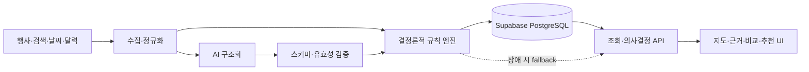

# 붐비 — 부산 AI 혼잡 예보

부산 주요 권역의 시간대별 혼잡 가능성을 계산하고, 점수의 근거와 대체 장소를 함께 제공하는 1인 개발 프로젝트입니다. 실제 인원수를 단정하는 서비스가 아니라 행사·평시 수요·검색 추세·날씨·달력 조건을 조합해 이동 판단을 돕는 상대적 예보를 제공합니다.

## 1분 안에 살펴보기

| 먼저 볼 항목 | 확인할 내용 |
| --- | --- |
| [문제해결 사례](docs/problem-solving.md) | AI의 역할 제한, 외부 서비스 장애 대응, 정확도 표현 기준 |
| [점수 엔진](domain/forecast/score.ts) | 입력별 가중치, 행사 가산점, 점수 제한과 위험 단계 |
| [행사 갱신 파이프라인](providers/event-refresh.ts) | 변경 감지, 분석 재사용, 동시성·호출량 제한과 fallback |
| [AI 출력 통제](providers/openai-decisions.ts) | 규칙 엔진이 확정한 후보·순서·점수를 AI가 바꾸지 못하도록 검증 |
| [자동화 테스트](tests/forecast-engine.test.mjs) | 점수 경계, 데이터 정규화, 추천·시나리오와 장애 대응 검증 |

## 프로젝트 정보

| 구분 | 내용 |
| --- | --- |
| 형태 | 1인 프로젝트 |
| 개발 기간 | 핵심 구현 약 3일 |
| 담당 | 기획, 데이터 모델, 예측 규칙, AI 연동, UI, 테스트, 배포 구조 |
| 기술 | TypeScript, React, Next.js App Router 호환 구조, Vinext/Vite, Supabase PostgreSQL, Drizzle ORM, Cloudflare Worker |
| 상태 | 기능 구현 및 제출 완료 · 공개 데모는 외부 DB 연결 없이 fallback 데이터로 동작 |

## 무엇을 만들었는가

- 부산 **42개 권역**의 **8일 예보**와 08시부터 22시까지의 시간대별 혼잡 점수
- 날짜별 상위 혼잡 지역, 지도 마커, 상세 근거와 지역·날짜 비교
- 방문 목적·혼잡도·이동 부담을 함께 고려한 대체 장소 3곳 추천
- 날씨·행사·평일/주말 조건을 바꾸는 시나리오 비교
- 공공·관광·검색 기반 행사 후보 수집, 정규화, 자동 승인과 검토 분리
- 예약 갱신, 중복 실행 방지, 실행 이력과 운영 제어 화면

## 핵심 설계 판단

### 1. AI와 점수 계산을 분리했습니다

AI는 행사 공지처럼 비정형인 입력을 구조화하거나 이미 계산된 결과를 설명하는 데 사용합니다. 최종 혼잡 점수, 대체 장소 후보와 순서, 시나리오 점수는 코드로 재현 가능한 규칙 엔진이 결정합니다. AI 응답이 형식 검증을 통과하지 못하거나 제공자가 실패하면 동일한 입력으로 규칙 기반 결과를 반환합니다.

### 2. 일부 데이터가 실패해도 예보는 유지됩니다

저장된 예보를 우선 조회하고, 사용할 수 없으면 기본 데이터에 날씨·검색 추세·행사·달력 조건을 순서대로 결합합니다. 행사 수집은 출처별 실패를 독립 처리하며, AI 분석은 기본 제공자 → 보조 제공자 → 규칙 기반 결과 순으로 낮아집니다. 변경되지 않은 행사는 저장된 분석을 재사용해 호출량도 줄였습니다.

### 3. 확인하지 못한 정확도를 주장하지 않았습니다

혼잡 점수는 실제 현장 인원수가 아닌 상대적 가능성입니다. 현장 관찰 표본이 충분하지 않은 상태에서는 적중률을 만들지 않고, 점수 경계·가중치·데이터 변환·fallback·추천 결과처럼 코드로 판정할 수 있는 불변 조건을 테스트했습니다.

자세한 문제 정의와 구현 과정은 [문제해결 사례](docs/problem-solving.md)에 정리했습니다.

## 구조



실행 경로와 장애 처리 순서는 [서비스 구조](docs/architecture.md)에서 확인할 수 있습니다.

## 핵심 코드 지도

| 영역 | 코드 | 확인할 내용 |
| --- | --- | --- |
| 점수·위험 단계 | [`score.ts`](domain/forecast/score.ts), [`confidence.ts`](domain/forecast/confidence.ts) | 가중치, clamp, 행사 중첩, 날씨 보정, 신뢰도 |
| 달력·시간대 | [`calendar-profile.ts`](domain/forecast/calendar-profile.ts), [`recommendation.ts`](domain/forecast/recommendation.ts) | 평일·주말·공휴일·방학 패턴과 2시간 추천 구간 |
| 행사 수집 | [`event-discovery.ts`](providers/event-discovery.ts), [`event-refresh.ts`](providers/event-refresh.ts) | 출처 통합, 중복 제거, 검토 분기, 변경 감지와 분석 재사용 |
| AI 경계 | [`ai-runtime.ts`](providers/ai-runtime.ts), [`openai-decisions.ts`](providers/openai-decisions.ts) | 제공자 전환, JSON 검증, 규칙 기반 fallback |
| 추천·시나리오 | [`fallback.ts`](domain/decision/fallback.ts) | 목적 적합도·혼잡도·이동 부담 계산과 조건별 점수 변화 |
| 저장·자동 갱신 | [`supabase-forecast-writer.ts`](repositories/supabase-forecast-writer.ts), [`refresh-forecast/route.ts`](app/api/internal/refresh-forecast/route.ts) | 잠금, 실행 이력, 8일 스냅샷 저장 |
| 화면 | [`page.tsx`](app/page.tsx) | 지도·시간대·근거·비교·혼잡 회피 도구 |

## 검증

```bash
pnpm install --frozen-lockfile
pnpm test
pnpm lint
```

- Node 기본 테스트 러너 기반 **2개 파일, 39개 테스트**
- `pnpm test`에서 프로덕션 빌드 후 예측 엔진과 서버 렌더링 결과 검증
- 점수 경계, 행사 중첩, 날씨·검색 변환, 42개 권역 응답, 추천·시나리오, 인증과 fallback 포함

## 한계

- 실시간 인원 계측값이나 확정 혼잡 수치를 제공하지 않습니다.
- 외부 데이터의 최신성·정확도와 실제 돌발 상황에 영향을 받습니다.
- 예측 정확도는 충분한 사후 관찰 표본이 모인 뒤에만 평가할 수 있습니다.
- 포트폴리오 공개 시점에는 Supabase 운영 연결을 종료했으며, 저장·갱신 구현 코드는 설계 검토용으로 유지합니다.
- 실제 서비스 운영에 필요한 자격증명과 로컬 환경값은 저장소에 포함하지 않습니다.

## 문서

- [문제해결 사례](docs/problem-solving.md)
- [서비스 구조](docs/architecture.md)
- [점수 모델](docs/scoring-model.md)
