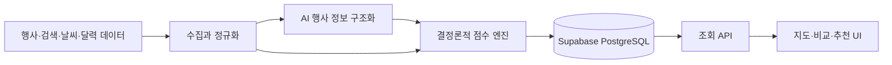

# 서비스 구조

```mermaid
flowchart LR
  Sources[행사·검색·날씨·달력 데이터] --> Normalize[수집과 정규화]
  Normalize --> AI[AI 행사 정보 구조화]
  AI --> Rules[결정론적 점수 엔진]
  Normalize --> Rules
  Rules --> DB[(Supabase PostgreSQL)]
  DB --> API[조회 API]
  API --> UI[지도·비교·추천 UI]
```

## 장애 대응

1. 기본 AI 제공자를 호출합니다.
2. 실패하거나 결과가 유효하지 않으면 보조 제공자를 시도합니다.
3. 두 제공자가 모두 실패하면 저장된 분석 또는 규칙 기반 결과를 사용합니다.
4. 최종 점수 계산은 AI 응답과 분리합니다.

