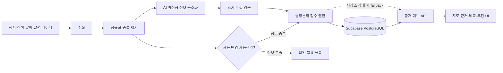
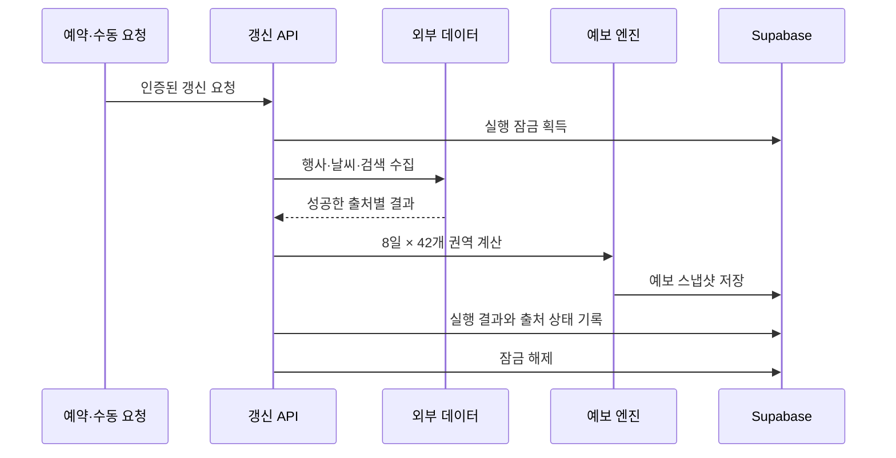

# 서비스 구조

## 전체 흐름

## 공개 예보 요청

[`GET /api/public/forecast`](../app/api/public/forecast/route.ts)은 다음 순서로 결과를 만듭니다.

1. 날짜 형식을 검증합니다.
2. Supabase에 저장된 예보가 있으면 우선 사용합니다.
3. 저장소가 비어 있거나 일시적으로 실패하면 기본 예보를 생성합니다.
4. 날씨 → 검색 추세 → 행사 → 달력 조건을 순서대로 반영합니다.
5. 전체 42개 권역 또는 요청한 한 권역만 반환합니다.
6. 응답 헤더에 `supabase` 또는 `demo-fallback` 출처를 표시합니다.

## 예약 갱신

[`POST /api/internal/refresh-forecast`](../app/api/internal/refresh-forecast/route.ts)은 인증과 실행 잠금을 통과한 요청만 처리합니다.

- 이미 실행 중이면 중복 갱신을 거부합니다.
- 수동 실행에는 60초 간격 제한을 적용합니다.
- 작업 성공·실패와 출처별 상태를 실행 이력에 남깁니다.
- `finally`에서 잠금 해제를 시도해 다음 실행이 영구적으로 막히지 않게 합니다.

## 행사 분석과 비용 통제

[`event-refresh.ts`](../providers/event-refresh.ts)는 행사 원문의 fingerprint를 저장된 값과 비교합니다. 새 행사이거나 내용이 변경된 경우에만 다시 분석하고, 변경이 없으면 기존 결과를 재사용합니다.

- 동시에 최대 4개 항목 처리
- 한 번의 갱신에서 실시간 AI 분석 최대 20건
- 종료된 행사 제외
- 날짜·장소·권역이 불완전하거나 장기간·다지역 행사면 검토 대상으로 분리
- AI를 사용할 수 없으면 규칙 기반 구조화 결과 사용

## 의사결정 도구

대체 장소와 조건 시나리오는 먼저 [`fallback.ts`](../domain/decision/fallback.ts)가 계산합니다. AI가 활성화되어도 후보, 순서, 혼잡 점수와 추천 시간은 이 계산 결과로 고정하며 AI는 설명만 보완합니다.

[`POST /api/public/ai-decisions`](../app/api/public/ai-decisions/route.ts)은 다음 안전장치를 적용합니다.

- 요청 크기·날짜·선택지 값 검증
- 원본 네트워크 주소 대신 SHA-256 파생 식별자로 요청 제한
- 10분당 12회 제한
- 같은 입력의 결과를 15분간 캐시
- AI 출력 스키마와 후보 순서 재검증
- AI 실패 시 규칙 기반 결과 반환

## 장애 대응 표

| 실패 지점 | 처리 |
| --- | --- |
| 특정 행사 출처 | `Promise.allSettled`로 다른 출처 결과 유지 |
| Supabase 조회 | 기본 예보 파이프라인으로 전환 |
| 날씨·검색 API | 해당 보정 없이 기존 예보 유지 |
| 기본 AI 제공자 | 보조 제공자 호출 |
| 모든 AI 제공자·출력 검증 | 저장된 분석 또는 규칙 기반 결과 사용 |
| 예약 작업 중복 실행 | 잠금 결과에 따라 409·429·503 등 명시적 응답 |

## 코드 경계

| 계층 | 책임 |
| --- | --- |
| `domain/` | 외부 서비스와 분리된 점수·추천·시나리오 규칙 |
| `providers/` | 행사·날씨·검색·AI 제공자 연결과 정규화 |
| `repositories/` | Supabase 읽기·쓰기와 갱신 상태 관리 |
| `app/api/` | 입력 검증, 인증, 캐시와 HTTP 응답 |
| `app/` | 사용자 화면과 관리자 화면 |
| `tests/` | 도메인 불변 조건과 서버 렌더링 결과 검증 |
